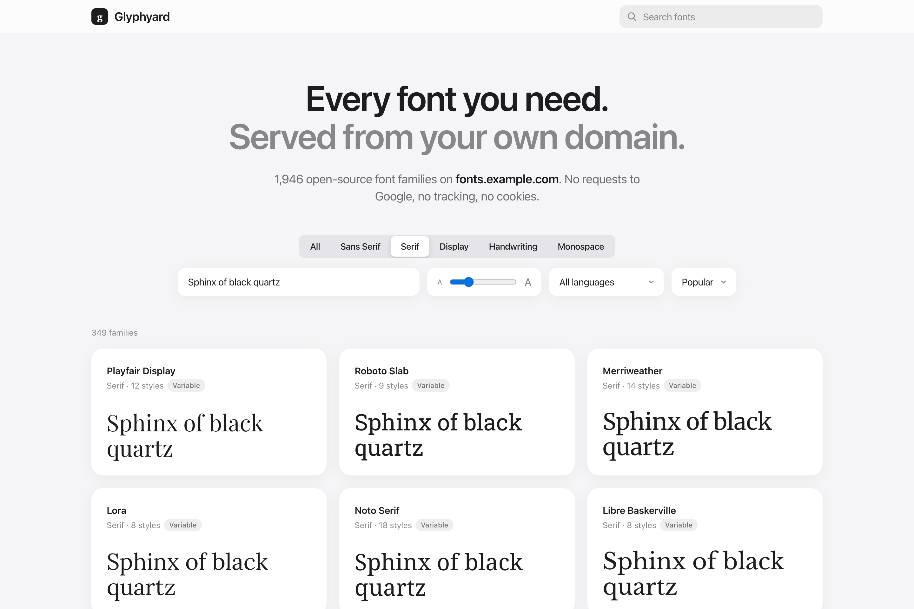

# Glyphyard

**Every font you need, served from your own domain.**

Deploy Glyphyard to a domain like `fonts.example.com`, browse the full Google
Fonts library, click the styles you want and copy the embed code. It works like
Google Fonts, but your visitors only ever talk to your domain.

**[Live demo →](https://glyphyard.patrickob.tech)**

[](https://glyphyard.patrickob.tech)

> The demo is open so you can try it. For your own sites, deploy your own
> instance. That's the whole point.

[](https://vercel.com/new/clone?repository-url=https%3A%2F%2Fgithub.com%2Fobrienafc%2Fglyphyard&project-name=glyphyard&env=GLYPHYARD_NAME&envDescription=Name%20shown%20in%20the%20header%20(optional))

## Features

- **One app, your domain.** The font browser and the font server are the same
  deployment. Nothing else to host, nothing else that can go away.
- **Drop-in Google Fonts API.** `/css2` and the legacy `/css` accept exactly the
  same parameters. To migrate, replace `fonts.googleapis.com` with your hostname.
- **Private.** Visitors' browsers never contact Google, and their IPs and user
  agents are never forwarded. No cookies, no analytics.
- **Fast.** Font files are cached on the CDN for a year (Google versions them,
  so they never change). CSS is cached for a day.
- **Every family, every style.** All ~1,900 families, variable weight ranges,
  italics, and a language filter.
- **Pairing view.** Set a heading and body font together over a public-domain
  passage (Joyce, Austen or Melville), swap them, and add both in one click.
- **Shareable links.** Selections (`?f=Inter:400,700&f=Lora:400:v`), pairings
  (`?pair=Playfair Display|Inter`) and views
  (`?category=serif&text=Hello&sort=newest&size=48`).
- **Light, dark or system appearance**, remembered per browser.

## Deploy

1. Click **Deploy with Vercel** above, or import this repo at vercel.com/new.
2. In the Vercel project, open **Settings → Domains** and add your domain, then
   create the DNS record Vercel shows you (usually a `CNAME` to
   `cname.vercel-dns.com`).
3. Visit your domain, pick fonts, and copy the `<link>` tag.

Or run it on any host with Node 20+:

```bash
npm install
npm run build
npm start
```

## Configuration

Set these as environment variables and redeploy. See `.env.example`.

| Variable             | Default     | Description |
| -------------------- | ----------- | ----------- |
| `GLYPHYARD_NAME`     | `Glyphyard` | Name shown in the header and page title. |
| `GLYPHYARD_FAMILIES` | *(all)*     | Comma-separated allowlist, e.g. `Inter,Playfair Display`. When set, only these families are listed and served. |
| `GLYPHYARD_ALLOWED_ORIGINS` | *(any site)* | Comma-separated sites allowed to embed your fonts, e.g. `example.com` (subdomains included). Other sites get a 403 with a note to deploy their own. Requests without an `Origin`/`Referer` (privacy tools) are still served. |
| `GLYPHYARD_SPILLCHECK_BADGE` | off | `1` shows a [Spillcheck](https://spillcheck.patrickob.tech) privacy badge in the footer. Off by default because it loads an image from Spillcheck. |

If your instance is public, set `GLYPHYARD_ALLOWED_ORIGINS` (or
`GLYPHYARD_FAMILIES`): bandwidth is billed to you. The public demo allows only
`patrickob.tech` sites to embed its fonts, but you can browse and pair freely.
Responses vary on `Origin` and `Referer`, so the CDN never hands one site's
cached fonts to another.

## How it works

```
Browser ──/css2?family=Inter──▶ your domain ──▶ fonts.googleapis.com
        ◀── CSS with url(/s/...) ──           (font URLs rewritten)

Browser ──/s/inter/v20/....woff2──▶ your domain (CDN cache) ──▶ fonts.gstatic.com
```

- **CSS** (`app/css2/route.ts`, `app/css/route.ts`): fetched from Google as a
  modern browser, so every visitor gets woff2 with `unicode-range` subsets, then
  rewritten to root-relative URLs on your domain.
- **Font files** (`app/s/[...path]/route.ts`): streamed from fonts.gstatic.com
  with `immutable` cache headers, so after the first request they're served from
  the CDN.
- **Catalog** (`scripts/update-catalog.mjs`): runs before each build and saves
  the family list from Google's font metadata to `data/catalog.json`. If it
  can't be fetched, the committed snapshot is used, so builds never fail.
  Redeploy to pick up newly released families.

**Known limitation:** the catalog comes from `fonts.google.com/metadata/fonts`,
which Google uses for its own site but doesn't document. If its format changes,
the picker keeps working from the snapshot until the script is updated. Serving
fonts doesn't depend on it.

## License

MIT. Fonts are licensed by their respective authors; see
[Google Fonts attribution](https://fonts.google.com/attribution).

<sub>Inspired by [fontless](https://github.com/herber/fontless).</sub>
